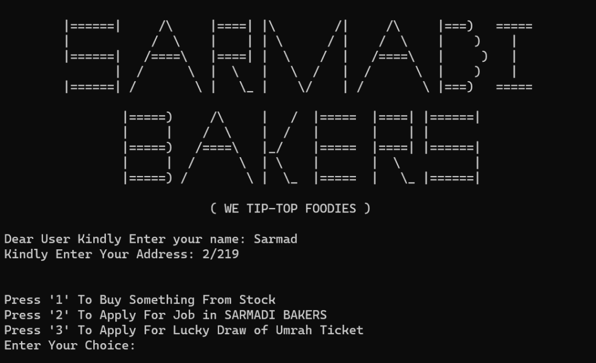
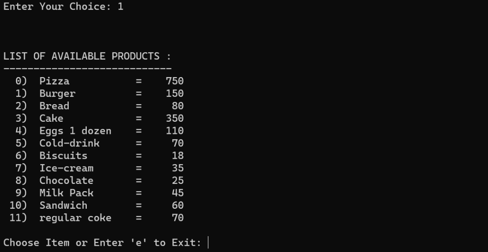
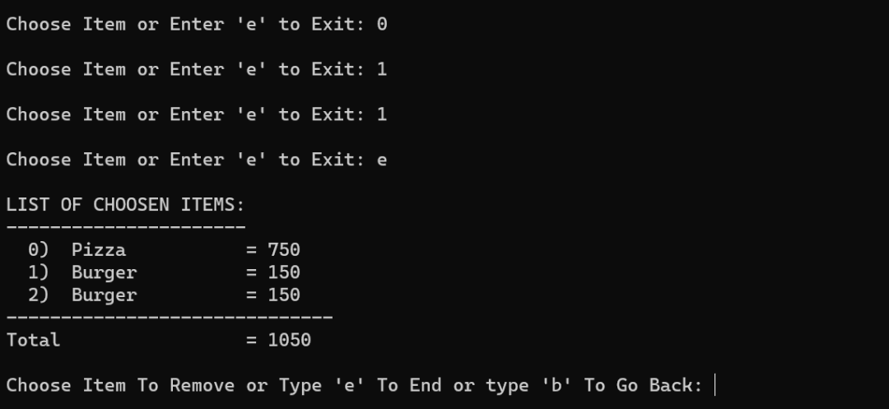
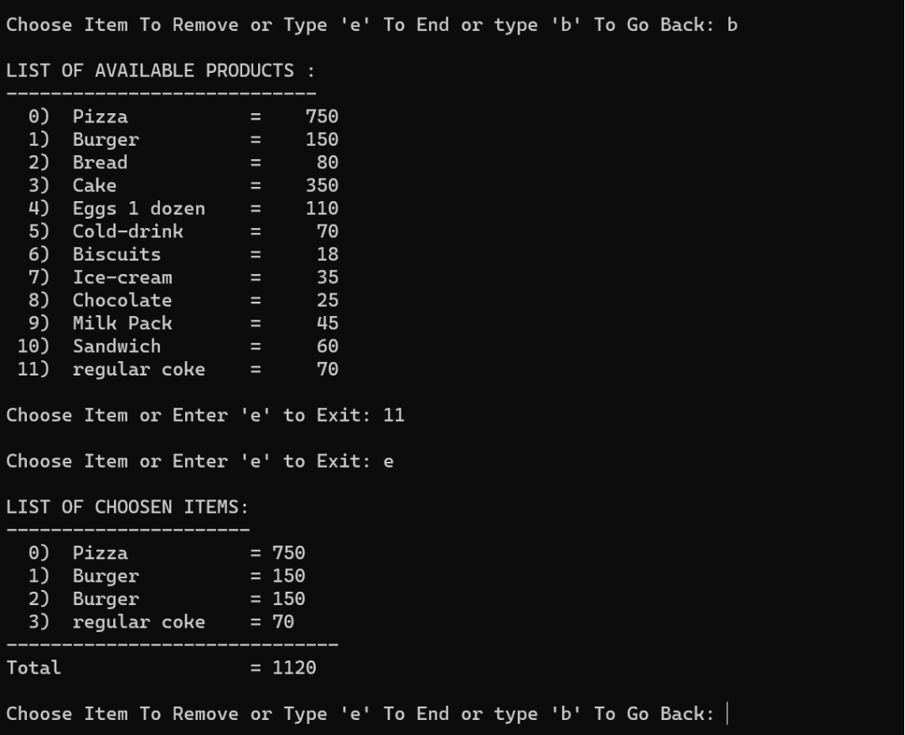
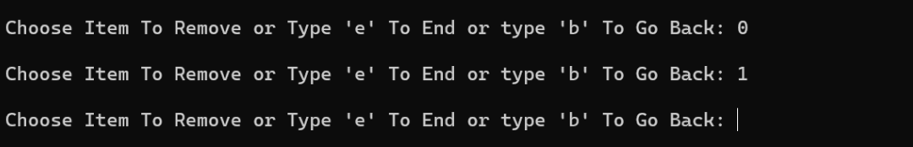
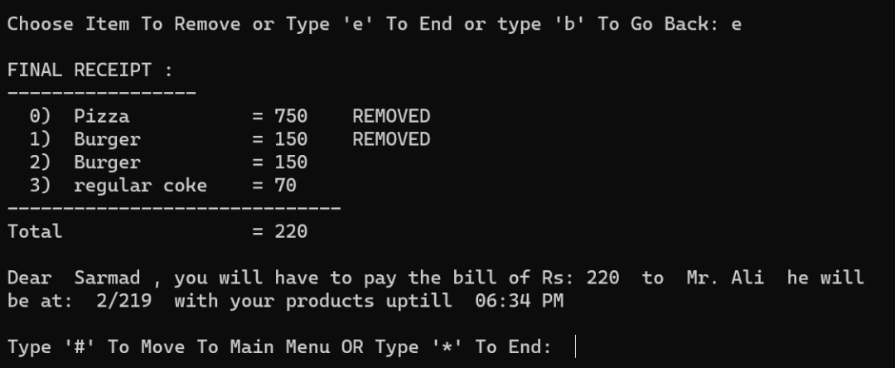
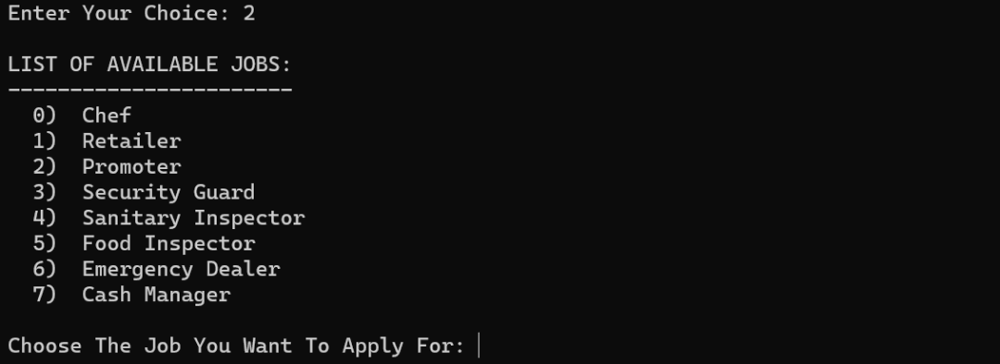

# sarmadi-bakers

It is a bakery management system that is built in pyton. It is the end-semester project of ICT.

## instructions

Follow the below step to run the code:

```
git clone https://github.com/MSarmadQadeer/sarmadi-bakers.git
cd sarmadi-bakers
python sarmadi_bakers.py
```

## demo

#### starter

When the code starts to execute, it asks for your name and address and gives you 3 choices.



### first choice :one:

On choice **1**, it shows you the list of products and their prices. It asks you to select an item or exit.
_(Products and prices are coming from the data.json file)_



#### multiple times selection

It's prossible to select an item multiple time.

When you exit it displays the list of selected items and the current bill. It asks you to **choose item to remove**, **to end purchase** or **to move back**.



#### to move back

If you forget to purchase something, then purchase it now.



#### to remove an item

If you buy an item and now your bill is out of your range. So, you wanted to remove some items to make the bill affordable.

So, you can remove items before ending your purchase.



#### to end the purchase

When you end the purchase, it displays the final receipt and a message. The time in the message is **30 mins** in the current time.

The name **Mr. Ali** in the message is the name of one of our employees in the employee's list. Employee's list is stored in the _data.json_ file. Mr. Ali is randomly selected from the list.



### second choice :two:

On choice **2**, it displays the list of available jobs. If you apply to any one of them, it asks certain questions. If you fulfill the requirements, then you are called for the interview.



### third choice :three:

You can apply for the lucky draw in choice **3**. The default limit of appliers for the Umrah ticket is four. You can change that limit. If the limit reaches, someone from the appliers is randomly selected and gets the Umrah ticket.
